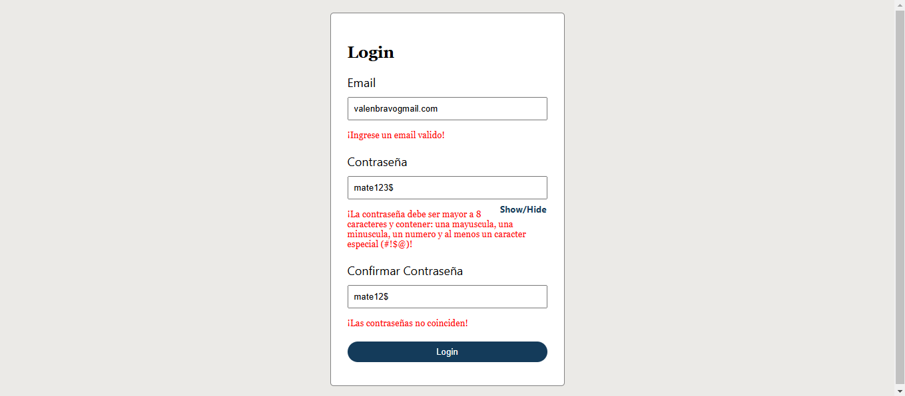

# Formulario de Login
## Habilidades Practicadas
- Mail con validación de formato
- Ocultar la contraseña
- Validar coincidencia de contraseñas
- Guardar el mail en local storage
- Practica de json

## Imagen
¡Haga click en la imagen para interactuar con la página!

  

